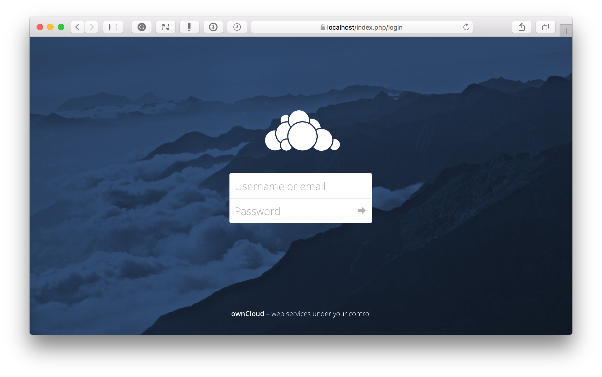

# Installing and Configuring ownCloud
{: .no_toc }

## Table of Contents
{: .no_toc .text-delta }

1. TOC 
{:toc}


## Introduction

ownCloud is an open source software for hosting your own cloud with the capabilities of files sharing ensuring secure and compliant file synchronization from your Desktop or Mobile devices. 

This quick-start guides you through the installation and configuration of the ownCloud Server on your local machine. It also provides information about user management, server access, and desktop and mobile syncronization.  

## Prerequistes

Before progressing with the Installation, ensure you have the following:

- An enterprise grade Linux Operation System with administrative privileges

- Docker and Docker compose

- Firefox Browser

The prerequistes here lists only the minimum requirements for the ownCloud to Install and run sucessfully on a local machine using the steps provided in the following sections. 

For detailed Deployment considerations, Deployment recommendations, and requirements, See [System Requirement](https://doc.owncloud.org/server/10.1/admin_manual/installation/system_requirements.html).

## Installing ownCloud Server

The following steps shows how to install the ownCloud Server on a local machine using docker and docker-compose.

Create a new project directory

1. ```bash
   mkdir owncloud-docker-server
   cd owncloud-docker-server
   ```

2. From the [OwnCloud Docker GitHub repository](https://github.com/owncloud-docker/server.git), download the *docker-compose.yml* file to the directory
   
   ```bash
   wget https://raw.githubusercontent.com/owncloud-docker/server/master/docker-compose.yml
   ```

3. Create a *.env* file in the directory and add the following configuration settings to that file:
   
   ```bash
   cat << EOF > .env
   
   OWNCLOUD_VERSION=10.0.10
   OWNCLOUD_DOMAIN=localhost
   
   HTTP_PORT=80
   
   ADMIN_USERNAME=admin
   ADMIN_PASSWORD=admin
   EOF
   ```

4. Build and start the container using docker-compose
   
   ```docker
   docker-compose up -d
   ```

5. After the completion of the process, verify all the containers have started
   
   ```docker
   docker-compose ps
   ```
   
   The following output is displayed:
   
   ```bash
   Name                Command                       State             Ports
   __________________________________________________________________________________________
   server_db_1         /usr/bin/entrypoint/bin/s …   Up                3306/tcp
   server_owncloud_1   /usr/local/bin/entrypoint …   Up                0.0.0.0:8080->8080/tcp
   server_redis_1      /bin/s6-svscan /etc/s6        Up                6379/tcp
   ```

6. Open [http://localhost:8080](http://localhost:8080/) in your Firefox browser. The standard ownCloud login screen is displayed. Use **admin** and **admin** for username and password.
   
    

---

**Note**:

The steps provided in this section are not intended for production and only provides a quick way to get the ownCloud Server up and running. ownCloud also provides other options for installing and configuring the server on different platforms. For a comprehensive guide and installation steps, see [Installation Options](https://doc.owncloud.org/server/10.1/admin_manual/installation/) in the manual.

---

## Accessing the Server from the Internet

To access the server from an external network, you must forward the port 8080 to the IP address of your server

Follow the steps to forward the port:

1. Ensure that the server is reachable through localhost/8080 as described in the previous section. 

2. Find the local IP address of your server using the ifconfig (or IP address on Suse Linux) command.

3. Login to your router configuration page from a browser and navigate to the Port Forwarding Setting. Refer to your router manual for instructions.

4. Enter the external and internal port numbers as 8080.

5. In the To IP address field, enter the local IP of your server that you retrieved in Step 2 and **Save** the settings

6. Find your public IP address using services such as [https://www.whatismyip.com](https://www.whatismyip.com)

7. Access your server using *Public_IP_Address:8080*

## Adding User Accounts

The **Users** Page on the ownCloud WebUI provides options to create user accounts and additionally assign each of the users to groups.

1. Login to the ownCloud WebUI and navigate to the **Users** Page by selecting the top right button on the screen.

2. Create **Users** group by specifying the username and password.

3. Create user accounts by specifying the username and password for each of the users. Assign the newly created accounts to the group **Users** that you created in the previous step.

For more details about the Users Page, see [User Management](https://doc.owncloud.org/server/9.0/admin_manual/configuration_user/user_configuration.html#creating-a-new-user)

## Connecting to ownCloud Server from Desktop

You can use the WebUI as shown before to access the server and save your local files on your cloud. However, OwnCloud provides Desktop Sync Client as an option for keeping your data syncronized with the server at all times. For other benefits and features of the Desktop client, see the [ownCloud Client Manual](https://doc.owncloud.org/desktop/2.1/introduction.html)

The Desktop Client is supported on Linux, Mac OS X, and Microsoft Windows. 

To install the desktop client on Windows and Mac OS X, download the installer from the following links:

* [Windows Desktop Client](https://download.owncloud.com/desktop/stable/ownCloud-2.5.4.11654.11466.msi)

* [Mac OS Desktop Client](https://download.owncloud.com/desktop/stable/ownCloud-2.5.4.11456.pkg)

Launch the installation, and follow the onscreen instructions on the installation wizard. For detailed information about the onscreen options, see [Installing the Desktop Synchronization Client](https://doc.owncloud.org/desktop/2.1/installing.html)

To install the desktop client on Linux, follow the instructions on the [download page](https://software.opensuse.org/download/package?project=isv:ownCloud:desktop&package=owncloud-client).

## Connecting to ownCloud Server from a Mobile Device

You can access, syncronize and upload your data on the go using the ownCloud Mobile apps available on both the Apple App Store and the Google Play Store.

See [Using the ownCloud iOS App](https://doc.owncloud.org/ios/) for information about managing data using the iOS App.

See [Using the ownCloud Android App](https://doc.owncloud.org/android/) for information about managing data using the Android App.
